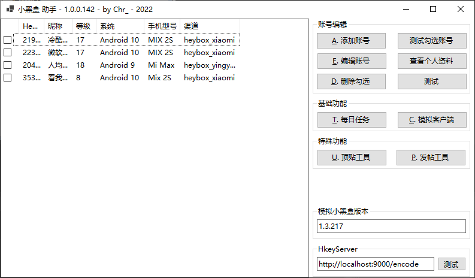

# Xiaoheihe_CShape

> Xiaoheihe_CShape 是一个基于 C# 的异步小黑盒客户端, 支持多账号, 交流群: 916945024

> 本项目仅用于学习交流使用, 任何衍生用途与作者无关

## TODO

> 已实现的 API

- [x] 获取首页文章
- [x] 签到
- [x] 获取账号信息
- [x] 获取任务状态
- [x] 获取签到日历
- [x] 新闻点赞
- [x] 获取动态
- [x] 新闻评论
- [x] 删除新闻评论
- [x] 获取用户发帖
- [x] 获取用户动态
- [x] 获取用户关注列表
- [x] 获取用户粉丝列表
- [x] 关注/取关用户
- [x] 收发私信
- [x] 上传图片
- [x] 分享
- [x] 评论点赞
- [x] 获取标签
- [x] 获取游戏详情
- [x] 获取评论内容
- [x] 获取文章内容
- [ ] ...

## Hkey Server

[Hkey Server](doc/hkey%20server.7z)

---

---
